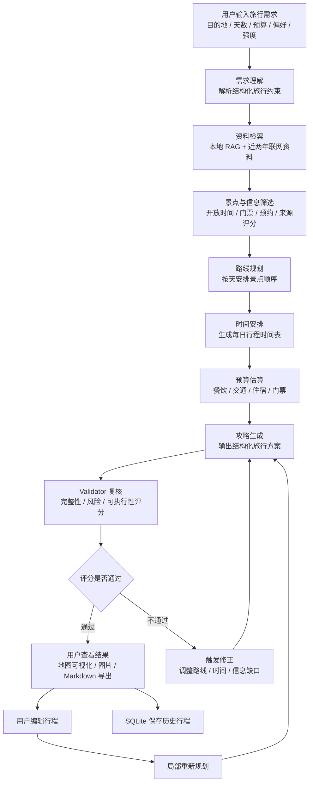
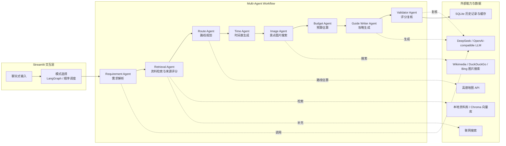
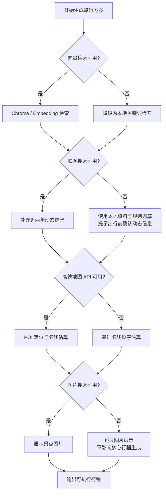

# Travel Agent Project - Architecture Diagrams

## Product Loop

```mermaid
flowchart TD
  A["用户输入旅行需求<br/>目的地 / 天数 / 预算 / 偏好 / 强度"] --> B["需求理解<br/>解析结构化旅行约束"]
  B --> C["资料检索<br/>本地 RAG + 近两年联网资料"]
  C --> D["景点与信息筛选<br/>开放时间 / 门票 / 预约 / 来源评分"]
  D --> E["路线规划<br/>按天安排景点顺序"]
  E --> F["时间安排<br/>生成每日行程时间表"]
  F --> G["预算估算<br/>餐饮 / 交通 / 住宿 / 门票"]
  G --> H["攻略生成<br/>输出结构化旅行方案"]
  H --> I["Validator 复核<br/>完整性 / 风险 / 可执行性评分"]

  I --> J{评分是否通过}
  J -->|通过| K["用户查看结果<br/>地图可视化 / 图片 / Markdown 导出"]
  J -->|不通过| L["触发修正<br/>调整路线 / 时间 / 信息缺口"]
  L --> H

  K --> M["用户编辑行程"]
  M --> N["局部重新规划"]
  N --> H
  K --> O["SQLite 保存历史行程"]
```

## Agent Workflow

```mermaid
flowchart LR
  subgraph UI["Streamlit 交互层"]
    U["聊天式输入"]
    Mode["模式选择<br/>LangGraph / 顺序调度"]
  end

  subgraph WF["Multi-Agent Workflow"]
    RQ["Requirement Agent<br/>需求解析"]
    RT["Retrieval Agent<br/>资料检索与来源评分"]
    RA["Route Agent<br/>路线规划"]
    TA["Time Agent<br/>时间表生成"]
    IA["Image Agent<br/>景点图片搜索"]
    BA["Budget Agent<br/>预算估算"]
    GW["Guide Writer Agent<br/>攻略生成"]
    VA["Validator Agent<br/>评分复核"]
  end

  subgraph External["外部能力与数据"]
    LLM["DeepSeek / OpenAI-compatible LLM"]
    RAG["本地资料库 / Chroma 向量库"]
    Search["联网搜索"]
    AMap["高德地图 API"]
    Img["Wikimedia / DuckDuckGo / Bing 图片搜索"]
    DB["SQLite 历史记录与缓存"]
  end

  U --> Mode --> RQ --> RT --> RA --> TA --> IA --> BA --> GW --> VA
  RQ -.调用.-> LLM
  RT -.检索.-> RAG
  RT -.补充.-> Search
  RA -.路线估算.-> AMap
  IA -.搜索.-> Img
  GW -.生成.-> LLM
  VA -.复核.-> LLM
  VA --> DB
```

## Fallback Strategy

```mermaid
flowchart TD
  A["开始生成旅行方案"] --> B{向量检索可用?}
  B -->|是| C["Chroma / Embedding 检索"]
  B -->|否| D["降级为本地关键词检索"]

  C --> E{联网搜索可用?}
  D --> E
  E -->|是| F["补充近两年动态信息"]
  E -->|否| G["使用本地资料与规则兜底<br/>提示出行前确认动态信息"]

  F --> H{高德地图 API 可用?}
  G --> H
  H -->|是| I["POI 定位与路线估算"]
  H -->|否| J["基础路线顺序估算"]

  I --> K{图片搜索可用?}
  J --> K
  K -->|是| L["展示景点图片"]
  K -->|否| M["跳过图片展示<br/>不影响核心行程生成"]

  L --> N["输出可执行行程"]
  M --> N
```

